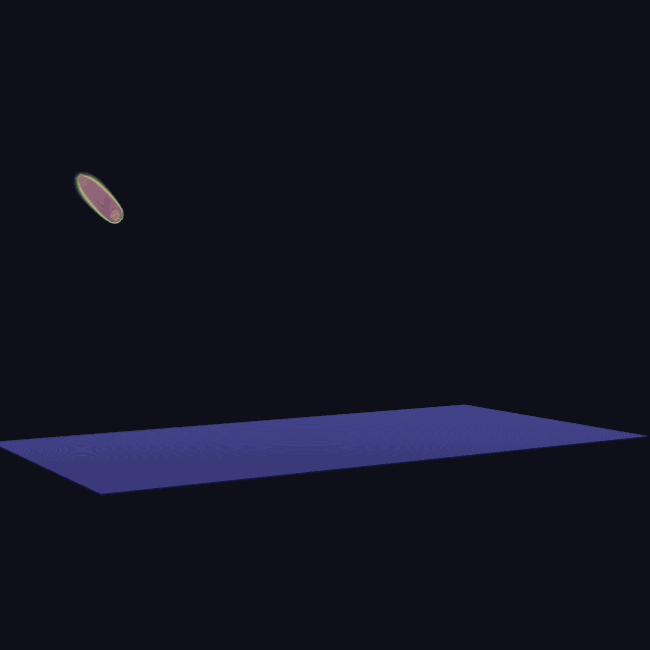
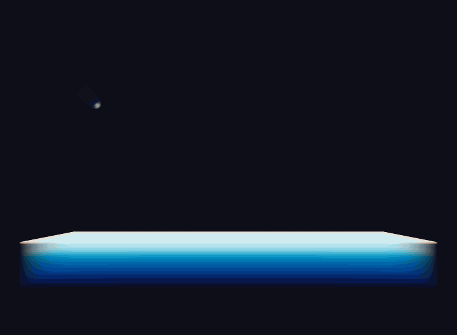

# Paraview_VTK
Course in Scientific Visualization and Virtual Reality (UvA 2020)

Website:
https://rebeccadavidsson.github.io/Paraview_VTK/





## Data
Data is downloaded from http://oceans11.lanl.gov/deepwaterimpact/yA31/300x300x300-FourScalars_resolution/ and stored in the ```data``` folder.

## Dependencies
```pip3 install -r requirements.txt```

## Running
Run the script to convert images from a given folder.
Specify in which folder the data is stored. Default is ```data```.


```
python3 VTKscript.py
```

## Running the server using cvlib
The cvlib package was used for this project (https://github.com/arunponnusamy/cvlib), made by Arun Ponnusamy in 2018.

Run by:
```
python -m http.server 8080
```
and open the ```index.html```


### Results
Temperature heatmaps of 4 different timesteps:


## Authors
* *Sam Verhezen*
* *Rebecca Davidsson*
